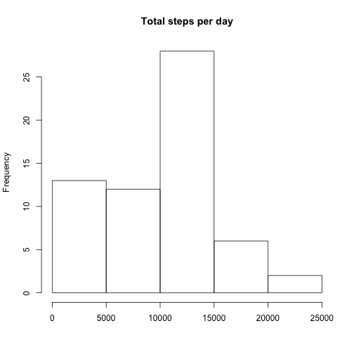
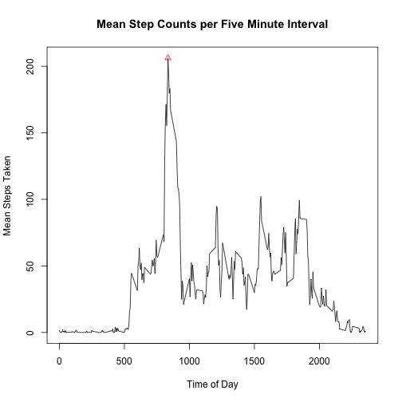
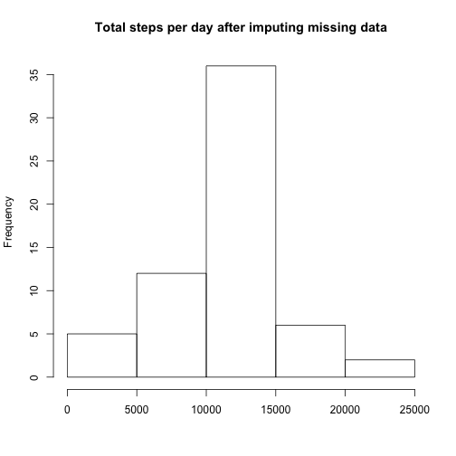
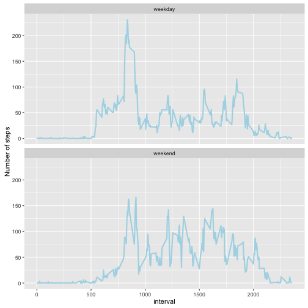

```r
library(dplyr)
```

## Loading and preprocessing the data
The histogram of daily total steps has natural band width of 5000. It shows that by a factor of about 2, the most frequent range for total daily step count was 10,000-15,000.


```r
stepData <- read.csv(unz("activity.zip", "activity.csv"))
perDay <- aggregate(stepData$steps, by=list(stepData$date), FUN="sum", na.rm=TRUE)
perDay <- rename(perDay, date=Group.1, steps=x)
hist(perDay$steps, main="Total steps per day", xlab=NULL)
```



## What is mean total number of steps taken per day?

```r
meanSteps <- mean(perDay$steps, na.rm=TRUE)
medianSteps <- median(perDay$steps, na.rm=TRUE)
```
The time series of daily totals has a mean of 9354.23 and a median of 10395.

## What is the average daily activity pattern?
In the present data, five-minute time-of-day intervals are given by an integer betwen 0 and 2355 representing the 24-hour starting time of the interval. For example, the integer 1635 represents the five-minute time-of-day interval 16:35 - 16:40. This time we aggregate the step data by time-of-day-interval: for each of the 288 five-minute intervals in a day, we take the mean number of steps taken during that interval in each day of the two-month period.


```r
perInterval <- aggregate(stepData$steps, by=list(stepData$interval), 
                         FUN="mean", na.rm=TRUE)
perInterval<-rename(perInterval, interval=Group.1, meanSteps=x)
maxAt <- which.max(perInterval$meanSteps)
plot(perInterval$interval, perInterval$meanSteps, type="l",
     main="Mean Step Counts per Five Minute Interval",
     xlab="Time of Day", ylab="Mean Steps Taken")
points(perInterval[maxAt,"interval"], perInterval[maxAt,"meanSteps"], 
       pch=24, col="red")
```



```r
tod0 <- perInterval[maxAt, "interval"]
tod0Hr <- tod0 %/% 100
tod0Min <- tod0 %% 100
if (tod0Min == 55) {
  tod1 <- (tod0Hr + 1) * 100
} else {
  tod1 <- tod0 + 5
}
tod1Hr <- tod1 %/% 100
tod1Min <- tod1 %% 100
tod0Str <- sprintf("%02d:%02d", tod0Hr, tod0Min)
tod1Str <- sprintf("%02d:%02d", tod1Hr, tod1Min)
maxAverageSteps <- sprintf("%.2f", perInterval[maxAt, "meanSteps"])
```

### Most active five-minute time-of-day interval
Averaged over all days in the two-month sample period, the subject took 206.17 steps  between 08:35 and 08:40. This was the most active of all five-minute time-of-day intervals and is depicted in red on the plot above.

## Imputing missing values
There are 2304 five-minute intervals in the two months of data for which the step count is missing. We turn to the question of imputing values where they are missing: we take the simple-minded approach that for any record with a missing step count, we will impute the mean step count for that record's interval. 


```r
row.names(perInterval) <- as.character(perInterval$interval)
augStepData <- stepData

augStepData$augSteps <- 
  ifelse(is.na(augStepData$steps), 
          perInterval[as.character(augStepData$interval), "meanSteps"],
          stepData$steps
   )

augPerDay <- aggregate(augStepData$augSteps, 
                        by=list(augStepData$date), FUN="sum")
augPerDay <- rename(augPerDay, date=Group.1, steps=x)

hist(augPerDay$steps, 
     main="Total steps per day after imputing missing data", xlab=NULL)
```



```r
meanAugSteps <- mean(augPerDay$steps)
medianAugSteps <- median(augPerDay$steps)
```

Imputing values to the intervals where step counts were missing clearly will increase the daily step totals. After we impute missing data, the time series of daily total steps has a mean of 10766.19 and a median of 10766.19.


## Are there differences in activity patterns between weekdays and weekends?

```r
library(ggplot2)
```


```r
augStepData$wdayWend <- factor(ifelse(
  weekdays(as.Date(augStepData$date)) %in% c("Saturday", "Sunday"),
  "weekend", "weekday")
)
perIntervalWdayWend <- aggregate(augSteps ~ wdayWend + interval,
                              data=augStepData, FUN=mean)
plt <- ggplot(perIntervalWdayWend, aes(interval, augSteps)) + 
       geom_line(size=1, color="lightblue")
plt + ylab("Number of steps") + facet_wrap(~ wdayWend, ncol=1) 
```



We have again aggregated the augmented steps data by taking means for each time-of-day-interval, but this time we discriminate between weekdays and weekends.
The subject is an early riser on weekdays (seems to be awake before 6 A.M) and has peak activity a little before 8:30 AM. . The weekend pattern is somewhat different. On weekends, subject becomes active somewhat later in the morning -- subject hits the 50 step-per-interval at around 8:00 AM instead of before 6:00 AM. During the day, subject in general walks more on weekends than on weekdays during the hours of 10:00 AM - 4:30 PM. Subject is quieter on weekends than on weekdays between 5:30 PM and 8:00PM, but seems to have some kind of brief activity right around 8:00 PM only on weekends.

Subject seems to be something of a homebody -- both on weekdays and weekends, there is very little activity after 9:00 PM.
